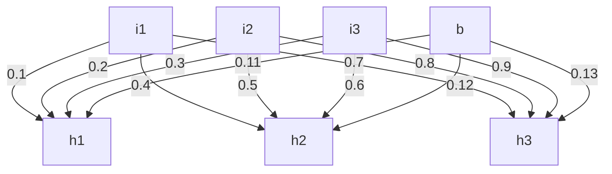

___
Low level **C++** neural network engine. The engine provides a huge flexibility in creating neural networks. It also gives an ability for performance optimisations. Details in the [optimisation](#neronebasecalculator) section of documentation.

## Table of Contest
* [NerOne](#nerone)
* [Table of Contest](#table-of-contest)
* [Build](#build)
* [Documentation](#documentation)
	* [Definitions](#definitions)
	* [Types and aliases](#types-and-aliases)
	* [class nerone::Node](#class-neronenode)
		* [constructor(nerone::value_t value)](#constructorneronevalue_t-value)
		* [constructor(nerone::value_t value, nerone::act_fn_t act_fn)](#constructorneronevalue_t-value-neroneact_fn_t-act_fn)
		* [nerone::value_t get_value()](#neronevalue_t-get_value)
		* [void set_value(value_t value)](#void-set_valuevalue_t-value)
		* [nerone::act_fn_t& get_act_fn()](#neroneact_fn_t-get_act_fn)
		* [void set_act_fn(act_fn_t fn)](#void-set_act_fnact_fn_t-fn)
		* [nerone::syn_list_t& get_syns()](#neronesyn_list_t-get_syns)
		* [void set_syns(syn_list_t syns)](#void--set_synssyn_list_t-syns)
		* [nerone::value_t get_output()](#neronevalue_t--get_output)
	* [class nerone::GNode : public nerone::Node](#class-neronegnode--public-neronenode)
		* [constructor(value_t val)](#constructorvalue_t-val)
		* [constructor(value_t val, act_fn_t act_fn, act_fn_t grad_fn)](#constructorvalue_t-val-act_fn_t-act_fn-act_fn_t-grad_fn)
		* [nerone::act_fn_t& get_gradient_fn()](#neroneact_fn_t-get_gradient_fn)
		* [void set_gradient_fn(act_fn_t fn)](#void--set_gradient_fnact_fn_t-fn)
		* [nerone::value_t get_gradient()](#neronevalue_t--get_gradient)
	* [class nerone::Syn](#class-neronesyn)
		* [constructor(shared_node_t node, value_t weight)](#constructorshared_node_t-node-value_t-weight)
		* [nerone::value_t get_weight()](#neronevalue_t--get_weight)
		* [void set_weight(value_t weight)](#void-set_weightvalue_t-weight)
		* [nerone::shared_node_t get_node()](#neroneshared_node_t--get_node)
		* [void set_node(shared_node_t node)](#void--set_nodeshared_node_t-node)
	* [class nerone::Layer](#class-neronelayer)
		* [constructor(node_list_t nodes)](#constructornode_list_t-nodes)
		* [node_list_t& get_nodes()](#node_list_t-get_nodes)
		* [void set_nodes(node_list_t nodes)](#void--set_nodesnode_list_t-nodes)
		* [size_t size()](#size_t-size)
		* [nerone::shared_node_t& operator[](size_t ind)](#neroneshared_node_t-operatorsize_t-ind)
		* [nerone::shared_node_t& get_bias()](#neroneshared_node_t-get_bias)
		* [void set_bias(shared_node_t bias)](#void--set_biasshared_node_t-bias)
	* [class nerone::Cluster](#class-neronecluster)
		* [constructor(layer_list_t layers)](#constructorlayer_list_t-layers)
		* [nerone::layer_list_t& get_layers()](#neronelayer_list_t-get_layers)
		* [void set_layers(layer_list_t layers)](#void-set_layerslayer_list_t-layers)
		* [shared_layer_t& first_layer()](#shared_layer_t-first_layer)
		* [shared_layer_t& last_layer()](#shared_layer_t-last_layer)
	* [class nerone::Box<M, T>](#class-neroneboxm-t)
		* [constructor(shared_cluster_t cluster)](#constructorshared_cluster_t-cluster)
		* [nerone::shared_cluster_t get_cluster()](#neroneshared_cluster_t-get_cluster)
		* [void set_cluster(shared_cluster_t cluster)](#void-set_clustershared_cluster_t-cluster)
		* [nerone::value_list_t question(value_list_t questions)](#neronevalue_list_t-questionvalue_list_t-questions)
		* [void correct(value_list_t answers)](#void-correctvalue_list_t-answers)
		* [void teach(value_list_t questions, value_list_t answers)](#void-teachvalue_list_t-questions-value_list_t-answers)
		* [M& get_multiplier()](#m-get_multiplier)
		* [T& get_teacher()](#t-get_teacher)
		* [nerone::value_list_t get_errors(value_list_t expected)](#neronevalue_list_t-get_errorsvalue_list_t-expected)
	* [Activation functions](#activation-functions)
		* [class nerone::activations::Sigmoid](#class-neroneactivationssigmoid)
		* [class nerone::activations::ReLU<R>](#class-neroneactivationsrelur)
		* [class nerone::activations::TanH](#class-neroneactivationstanh)
		* [class nerone::activations::ELU](#class-neroneactivationselu)
		* [class nerone::activations::GELU](#class-neroneactivationsgelu)
		* [class nerone::activations::SELU](#class-neroneactivationsselu)
		* [class nerone::activations::Swish](#class-neroneactivationsswish)
	* [Loss functions](#loss-functions)
		* [class nerone::loss::MeanSquareError](#class-neronelossmeansquareerror)
		* [class nerone::loss::CrossEntropy](#class-neronelosscrossentropy)
	* [Multipliers](#multipliers)
		* [nerone::multipliers::BaseMultiplier<O>](#neronemultipliersbasemultipliero)
	* [Teachers](#teachers)
		* [nerone::teachers::GradientDescent<N, L, O>](#neroneteachersgradientdescentn-l-o)
	* [nerone::BaseCalculator](#neronebasecalculator)
		* [static Matrix matrix_create(value_list_t list);](#static-matrix-matrix_createvalue_list_t-list)
		* [static Matrix matrix_from_layer_syns(shared_layer_t prev_layer, shared_layer_t layer)](#static-matrix-matrix_from_layer_synsshared_layer_t-prev_layer-shared_layer_t-layer)
		* [static void matrix_copy(Matrix& mat, value_list_t& list)](#static--void--matrix_copymatrix-mat-value_list_t-list-size_t)
		* [static void update_layer_weights(shared_layer_t prev_layer, shared_layer_t layer, Matrix& mat, value_t rate)](#static--void--update_layer_weightsshared_layer_t-prev_layer-shared_layer_t-layer-matrix-mat-value_t-rate)
		* [static void update_layer_biases(shared_layer_t prev_layer, shared_layer_t layer, Matrix& mat, value_t rate)](#static--void--update_layer_biasesshared_layer_t-prev_layer-shared_layer_t-layer-matrix-mat-value_t-rate)
	* [Calculator::Matrix](#calculatormatrix)
		* [Matrix::operator * (Matrix& mul)](#matrixoperator--matrix-mul)
		* [Matrix::transpose()](#matrixtranspose)
* [Usage example](#usage-example)
* [Tests](#tests)
	* [2 Zones problem (from the example in previous section)](#2-zones-problem-from-the-example-in-previous-section)
	* [4 Zones problem](#4-zones-problem)
	* [Circle problem](#circle-problem)
	* [Spiral problem](#spiral-problem)
* [Additional information](#additional-information)
* [License](#license)


## Build
Library was tested using **GNU G++** compiler with flag **-std=c++17**. So it is recommended to use C++ 17 or higher version of compiler. Compiling by other compilers may require code corrections.

`make` default command builds the tests and creates **test.exe** file in the root directory.

## Documentation

### Definitions
* **Node** - Smallest piece of a neural network containing value of this node and a list of connections to previous nodes and can return some output value produced by some activation function.
* **Bias** - special node that belongs to layer, which value is not calculated, nor set as input, but always equals **1**. This node defines some shift that always added to the hidden and/or output nodes values. 
* **Layer** - is a list of nodes. Layer can be *input* - first layer of the neural network. Each node's value of the a first layer defined by input parameters. There is always 1 input layer in a neural network. *output layer* - is a the last layer of a neural network. Values of the nodes of an output layer are the results of the neural network calculations (propagation). *hidden layer* - is a layer in between input and output layers. There may be more than 1 hidden layer in the network. 
* **Activation function** - is a function applied to the node's value to the the node's output.
* **Loss function** - is a function applied to all the output node's outputs to calculate the error of the neural network.
* **Training neural network** - means adjusting the neural network node's connection weights to decrease the error.
* **Error of neural network** - value showing the accuracy of neural network result. The higher error - the less accurate neural network.

Current engine provides **nerone** namespace where all the *classes*, *types* and *functions* are defined.

___
### Types and aliases
* **value_t** - alias for **double** type.
* **value_list_t** - alias for **std::vector\<value_t\>** type.
* **shared_node_t** - alias for **std::shared_ptr\<Node\>** type.
* **shared_syn_t** - alias for **std::shared_ptr\<Syn\>** type.
* **shared_layer_t** - alias for **std::shared_ptr\<Layer\>** type.
* **shared_cluster_t** - alias for **std::shared_ptr\<Cluster\>** type.
* **syn_list_t** - alias for **std::vector\<shared_syn_t\>**
* **node_list_t** - alias for **std::vector\<shared_node_t\>** type.
* **layer_list_t** - alias for **std::vector\<shared_layer_t\>** type.
* **act_fn_t** - alias for **std::function\<value_t(value_t)\>** type.

___
### class nerone::Node
Defines neural network **node**. Defines default copy and move constructors.

#### constructor(nerone::value_t value)
Creates instance of **Node** class, and defines *value* attribute of the node.

#### constructor(nerone::value_t value, nerone::act_fn_t act_fn)
Creates instance of **Node** class, and defines *value* and *act_fn* attributes of the node.

#### nerone::value_t get_value()
Returns node's value.

#### void set_value(value_t value)
Defines node's value property.

#### nerone::act_fn_t& get_act_fn()
Returns node's activation function.

#### void set_act_fn(act_fn_t fn)
Defines node's activation function.

#### nerone::syn_list_t& get_syns()
Returns list of connections to the previous layer (including **Syn** to the bias if exists)

#### void  set_syns(syn_list_t syns)
Defines list of connections to the previous layer of the neural network.

#### nerone::value_t  get_output()
Applies activation function to the node's *value* and returns the result.

___
### class nerone::GNode : public nerone::Node
Additionally declares methods to define and use gradient functions. Defines 

#### constructor(value_t val)
Creates instance of **GNode** class, and defines *value* property.

#### constructor(value_t val, act_fn_t act_fn, act_fn_t grad_fn)
Creates instance of **GNode** class and defines *value*, activation function and gradient function.

#### nerone::act_fn_t& get_gradient_fn()
Returns node's gradient function.

#### void  set_gradient_fn(act_fn_t fn)
Defines gradient function of the node.

#### nerone::value_t  get_gradient()
applies gradient function to the node's value, and returns the result.

___
### class nerone::Syn
Defines neural network connection between nodes from different neighbour layers (from current to previous layer). Class defines default copy and move constructors.

#### constructor(shared_node_t node, value_t weight)
Creates instance of **Syn** class and defines *node* and *weight* properties.

#### nerone::value_t  get_weight()
Returns syn's weight.

#### void set_weight(value_t weight)
Defines weight of the **Syn**

#### nerone::shared_node_t  get_node()
Returns smart pointer to the node from the previous layer connected to current **node**.

#### void  set_node(shared_node_t node)
Connects node from previous layer to current node. 

___
### class nerone::Layer
Defines neural network layer containing list of nodes included into the layer. Defines default copy and move constructors.

#### constructor(node_list_t nodes)
Creates instance of **Layer** class and defines list of layer's nodes.
***Note:*** node_list_t = vector\<std::shared_ptr\<Node\>\>

#### node_list_t& get_nodes()
Returns list of nodes of the current layer, or **nullptr** if it's not defined.

#### void  set_nodes(node_list_t nodes)
Defines layer's list of nodes.

#### size_t size()
returns the size of the layer's nodes list.

#### nerone::shared_node_t& operator\[\]\(size_t ind\)
Returns node from the list of nodes with index = **ind**.

#### nerone::shared_node_t& get_bias()
Returns layer's **bias** node. ***Note:*** it should always be defined, otherwise the behaviour is undefined.

#### void  set_bias(shared_node_t bias)
Defines **bias** node of the layer.

___
### class nerone::Cluster
Defines neural network structure. It collects all the layers but not defines any training or propagation algorithms. Defines default copy and move constructors.

#### constructor(layer_list_t layers)
Accepts list of layers, creates instance of Cluster class, defines list of layers of neural network.

#### nerone::layer_list_t& get_layers()
Returns a list of layers of neural network.

#### void set_layers(layer_list_t layers)
Defines layers of neural network.

#### shared_layer_t& first_layer()
Returns first layer from neural network (input layer), or throws if there are no layers.

#### shared_layer_t& last_layer()
Returns last layer from neural network (output layer), or throws if there are no layers.

___
### class nerone::Box<M, T>
Constructor of the class accepts cluster and defines basic interface for propagation and back propagation algorithms as well as finding errors.

It accepts 2 template parameters: 
* **M** is multiplier class used by propagation method of the interface. 
* **T** is teacher class used by back propagation method of the interface.

#### constructor(shared_cluster_t cluster)
Creates instance of the class and defines cluster attribute.

#### nerone::shared_cluster_t get_cluster()
Returns cluster of the neural network.

#### void set_cluster(shared_cluster_t cluster)
Defines cluster of the neural network.

#### nerone::value_list_t question(value_list_t questions)
Checks that number of items in **questions** equals to a number of nodes in the first layer of *cluster*, and runs **M** (multiplier) class instance "()" operator function with **cluster** as the first parameter, and **questions** as the second parameter.

#### void correct(value_list_t answers)
Checks that numbers of items in **answers** equals to a number of nodes in the last layer of *cluster*, and runs **T** (teacher) class instance "()" operator function with **cluster** as the first parameter, and **answers** as the second parameter. 

Running this method requires values of cluster's nodes to be set by performing *question* method.

#### void teach(value_list_t questions, value_list_t answers)
Runs **question** and **correct** with corresponding parameters **questions** and **answers**.

#### M& get_multiplier()
Returns instance of **M** (multiplier) class. It allows you to set up any dynamic parameters you need before or between "asking questions".

#### T& get_teacher()
Returns instance of **T** (teacher) class. It allows you to set up any dynamic parameters you need before or between "trainings".

#### nerone::value_list_t get_errors(value_list_t expected)
Runs **T::get_errors** with **expected** as the first argument of the function, and returns the result. The resulting list contains error value for each output node.

Running this method requires values of cluster's nodes to be set by performing *question* method.

___
### Activation functions
There is a namespace **nerone::activations** with a bunch of activation functions already defined. Each of them consist of a class with 2 *public* *static* members **fun** and **grad** - *activation function* itself and a *derivative* of the activation function.

All activation functions described below live under the **nerone::activations** namespace.

***Usage example:***
```c++
auto* node = new nerone::GNode(0, nerone::activations::Sigmoid::fun, nerone::activations::Sigmoid::grad);
```

### class nerone::activations::Sigmoid
The sigmoid function is a logistic function, which means that, whatever you input, you get an output ranging between 0 and 1.

### class nerone::activations::ReLU\<R\>
Parametric Reflicter activation function. For values less than 0, the result equals to value param. For values greater than 0, the result doesn't change. *R* should implement **std::ratio** class.

***Example:***
```c++
// Define class with parameter = 1/10 = 0.1
using ReLU01 = nerone::activations::ReLU<std::ratio<1,10>>

ReLU01::fun(-10) // 1
ReLU01::fun(15) // 15
```

### class nerone::activations::TanH
The output of the tanh activation function is Zero centered; hence we can easily map the output values as strongly negative, neutral, or strongly positive. Usually used in hidden layers of a neural network.

### class nerone::activations::ELU
Parametric Exponential Linear Unit activation function. For values less than 0, the result goes to -1 softly. Parameter decides the curve line for negative values. For values greater than 0, the result doesn't change. *R* should implement **std::ratio** class.

### class nerone::activations::GELU
Gaussian Error Linear Unit activation function. For values much less than 0, the result equals 0, but for values slightly less than 0, the result slightly less than 0. For values greater than 0 the result doesn't change.

### class nerone::activations::SELU
Scaled Exponential Linear Unit. This activation functions is one of the newer one's.

### class nerone::activations::Swish
Swish is a smooth, non-monotonic function that consistently matches or outperforms *ReLU* on deep networks applied to a variety of challenging domains such as Image classification and Machine translation.

___
### Loss functions
There is a **nerone::loss** namespace with **2** loss functions already defined. Each of them consist of a class with 2 *public* *static* members **fun** and **grad** - *activation function* itself and a *derivative* of the activation function.

All loss functions described below live under the **nerone::loss** namespace.

### class nerone::loss::MeanSquareError
Mean squared error (MSE) is the most commonly used loss function for regression. The loss is the mean overseen data of the squared differences between true and predicted values.

### class nerone::loss::CrossEntropy
Cross-entropy loss, or log loss, measures the performance of a classification model whose output is a probability value between 0 and 1. Cross-entropy loss increases as the predicted probability diverges from the actual label.

___
### Multipliers
There is a **nerone::multipliers** namespace defining multiplier classes.
Each such class should implement **()** operator function accepting **shared_cluster_t& cluster** as the first argument, and **value_list_t&& values** as the second argument, and should propagate values through the layers of the **cluster**.

There is one multiplier class already defined under **nerone::multipliers** namespace.

### nerone::multipliers::BaseMultiplier\<O\>
Class implements neuron network propagation algorithm. Accepts template parameter O that allow to provide multiplication optimisations. **O** class should implement **nerone::BaseCalculator** interface.

By default **nerone::BaseCalculator** used as a template parameter.

___
### Teachers
There is a **nerone::teachers** namespace defining teachers classes.
Each such class should implement **()** operator function accepting **shared_cluster_t& cluster** as the first argument, and **value_list_t&& values** as the second argument, and should back propagate values through the layers of the **cluster** adjusting weights of the **syns** to reduce the *error* of the neural network.

Each teacher class *must* also implement **get_errors** function returning **value_list_t**, and accepting **shared_cluster_t& cluster** as the first argument, and **value_list_t expected** as the second argument.
This function should calculate error of each output node and return this list of errors.

There is one teacher class already defined under **nerone::teachers** namespace.

### nerone::teachers::GradientDescent<L, O>
Class implements the most common **Gradient Descent** neural network back propagation algorithm. It accepts **2** template parameters:
***Note:*** Additionally, nodes that are used in the cluster should implement **GNode** interface. It adds a single **get_gradient** method to the base **Node** returning gradient of the *value* node's property.
* **L** corresponds to the *loss function* type. See the [section](#loss-functions) above.
* **O** corresponds to the *optimisation* class. It should implement **nerone::BaseCalculator** interface.
	By default **nerone::BaseCalculator** class used as **O** template parameter.

***Example:***
```c++
auto cluster = generate_cluster(); // generates cluster, lol
auto box = new nerone::Box<nerone::multipliers::BaseMultiplier<>, nerone::teachers::GradientDescent<nerone::GNode, nerone::loss::MeanSquareErrors>>(cluster);
```

___
### nerone::BaseCalculator
Takes care about all the calculations needed to perform **GradientDescent** and **BaseMultiplier** algorithms.

It is not optimised to use *multi cores* or *kernel* and it is here to provide simple one core multiplication examples.

Your **Calculator** class *must* define **Matrix** public type (see [details](#calculatormatrix) below)

Also it must define next public methods:

#### static Matrix matrix_create(value_list_t list);
This method should create and return *1xN* **Matrix** instance from the list of values sent as the first parameter.

#### static Matrix matrix_from_layer_syns(shared_layer_t prev_layer, shared_layer_t layer)
This method is a bit tricky, but it is very important. This method should create matrix of **layer** node's syns. So first row of the matrix should contain all weights from the layer's first node, second row should contain all weights from the second node, etc. ***Note:*** Biases are always included to rows.

It's a bit tricky, so see the example below:

***Example:***


Having a part of neural network as showed above, and considering 
**h1**, **h2**, **h3** nodes belongs to **layer**, and **i1**, **i2**, **i3**, and **b** as bias, belongs to **prev_layer**, the result of **matrix_from_layer_syns** call with arguments **prev_layer**, **layer** would be next *matrix*:

```json
[
	[0.1, 0.2, 0.3, 0.11],
	[0.4, 0.5, 0.6, 0.12],
	[0.7, 0.8, 0.9, 0.13]
]
```

#### static  void  matrix_copy(Matrix& mat, value_list_t& list)
Copies values from the matrix **mat** to the list **list**.

#### static  void  update_layer_weights(shared_layer_t prev_layer, shared_layer_t layer, Matrix& mat, value_t rate)
Updates each of the **layer** node's syn's weight. Basically it copies all the values from matrix **mat** multiplied by the **rate** back to the layer node's weights.

***Note:*** It shouldn't update layer's bias weights.

#### static  void  update_layer_biases(shared_layer_t prev_layer, shared_layer_t layer, Matrix& mat, value_t rate)
Similar to the previous method, this one updates just *bias* node weights of the **layer** from the **mat** first row multiplied by **rate**.

***Note:*** *for more details, please, look at the **nerone::Basealculator** class implementation.*

___
### Calculator::Matrix
Your calculator class should define **Matrix** type, and this type should implement next methods

#### Matrix::operator * (Matrix& mul)
Multiplies *this* matrix with the one passed as the first argument, and returns new matrix with values equals to the result of 2 matrixes multiplication.

#### Matrix::transpose()
Transposes the matrix modifying current matrix values.

## Usage example

There is a **nerone.hpp** file that includes all other *nerone* header files.

```c++
#include "nerone.hpp"

// Generates random double number.
double rand_double() {
	return (rand() % 1000000) / (double)1000000;
}

// Creates neural network Box with BaseMultiplier and GradientDescent template parameters.
// GradientDescent uses CrossEntropy loss function.
// input 2N -> hidden 6N -> hidden 6N -> output 2N with biases
// Weights assigned randomly from -1 to 1.
auto create_box() {
	nerone::layer_list_t layers;
	std::vector<int> layer_nodes_count{2, 6, 6, 2};
	size_t j=0;
	for(auto c : layer_nodes_count) {
		nerone::node_list_t node_list;
		for(int i=0;i<c;i++){
			nerone::act_fn_t act, grad;
			if(j && j < layer_nodes_count.size()-1) {
				act = nerone::activations::Sigmoid::fun;
				grad = nerone::activations::Sigmoid::grad;
			}
			if(j == layer_nodes_count.size()-1) {
				act = nerone::activations::Sigmoid::fun;
				grad = nerone::activations::Sigmoid::grad;
			}
			
			auto node = std::make_shared<nerone::GNode>(0, act, grad);
			
			if(j) {
				nerone::syn_list_t syns;
				auto& prev_layer = *layers[layers.size()-1];
				for(size_t k=0;k<prev_layer.size();k++){
					syns.push_back(std::make_shared<nerone::Syn>(prev_layer[k], rand_double()*2-1));
				}
				syns.push_back(std::make_shared<nerone::Syn>(prev_layer.get_bias(), rand_double()*2-1));
				node->set_syns(syns);
			}
			node_list.push_back(node);
		}
		
		auto layer = std::make_shared<nerone::Layer>(node_list);
		layer->set_bias(std::make_shared<nerone::GNode>(1));
		
		layers.push_back(layer);
		
		j++;
	}
	
	auto cluster = std::make_shared<nerone::Cluster>(layers);
	
	auto b = nerone::Box<
		nerone::multipliers::BaseMultiplier<>,
		nerone::teachers::GradientDescent<nerone::GNode, nerone::loss::CrossEntropy>
	>(cluster);
	
	return b;
}

// Structure defining point on a plane, and bool parameter defining
// if the point belongs to red team or to blue team (true and false)
struct Point {
	double x;
	double y;
	bool red;
};

// Creates set of points devided for 2 sections, and puts red points
// to the top-right area of the plane, and blue points to the
// bottom-right are of the plane.
std::vector<Point> create_labeled_inputs_zones_2() {
	std::vector<Point> res;
	
	// top-right zone
	for(int i=0;i<100;i++){
		double len = rand_double() * 15;
		double a = rand_double() * PI * 2;
		res.push_back({len * std::sin(a) + 65, len * std::cos(a) + 35, true});
	}
	
	// bottom-left zone
	for(int i=0;i<100;i++){
		double len = rand_double() * 15;
		double a = rand_double() * PI * 2;
		res.push_back({len * std::sin(a) + 35, len * std::cos(a) + 65, false});
	}
	
	return res;
}

int main() {
	// Randomize values
	srand (time(NULL));
	
	// Create neural network
	auto box = create_box();
	
	// Create input data
	std::vector<Point> labeled = create_labeled_inputs_zones_2();

	// Training neural network
	for(int i=0;i<300;i++) {
		for(auto& it : labeled){
			double x = it.x/100 * 2 - 1;
			double y = it.y/100 * 2 - 1;
			box.teach({x, y}, {it.red ? 1.0 : 0.0, it.red ? 0.0 : 1.0});
		}
	}

	return 0;
}
```

Besides that you can also log the error of the neural network. In this example I didn't log *error* of the network, but in the [tests](tests) section I show up more useful data, and illustrations of neural network trainings.

## Tests

Regular unit tests are placed under the **tests** folder.

Using the example I build above, with logging of additional useful data such as error function, and tests results I've been able to train neural network for different classification problems:

### 2 Zones problem (from the example in previous section)

* training step: **20** | error: **0.470739** 

  
* training step: **40** | error: **0.0616046**

  
* training step: **80** | error: **0.0130729**

  
* training step: **100** | error: **0.00906824**

  

### 4 Zones problem

* training step: **30** | error: **0.626602**

  
* training step: **120** | error: **0.114609**

  
* training step: **240** | error: **0.029581**

  
* training step: **300** | error: **0.0197742**

  

### Circle problem

* training step: **80** | error: **0.678708**

  
* training step: **160** | error: **0.617172**

  
* training step: **280** | error: **0.371635**

  
* training step: **400** | error: **0.0287993**

  

### Spiral problem

* training step: **1000** | error: **0.662982**

  
* training step: **4000** | error: **0.479241**

  
* training step: **7000** | error: **0.133034**

  
* training step: **10000** | error: **0.0362706**

  

As we can see, the neural network is able to be trained to solve these classification problems.

## Additional information

This project is a **low level** neural network engine. It is not a complete neural network framework you can use for real world tasks. To be so, additional wrapper required to be built on top of this engine providing methods to easier build of neural network, and even more important, reliable **optimisation algorithms** needs to be implemented to improve neural network training performance. More details read in [BasicCalculator](#neronebasecalculator) section.

## License
MIT

Have fun :)
